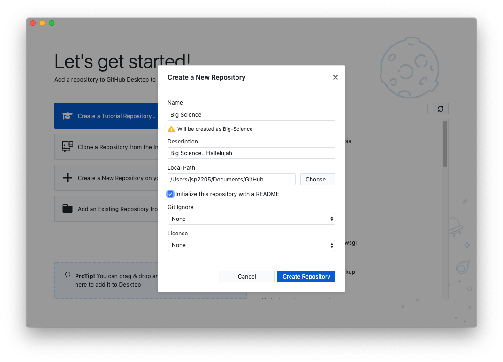
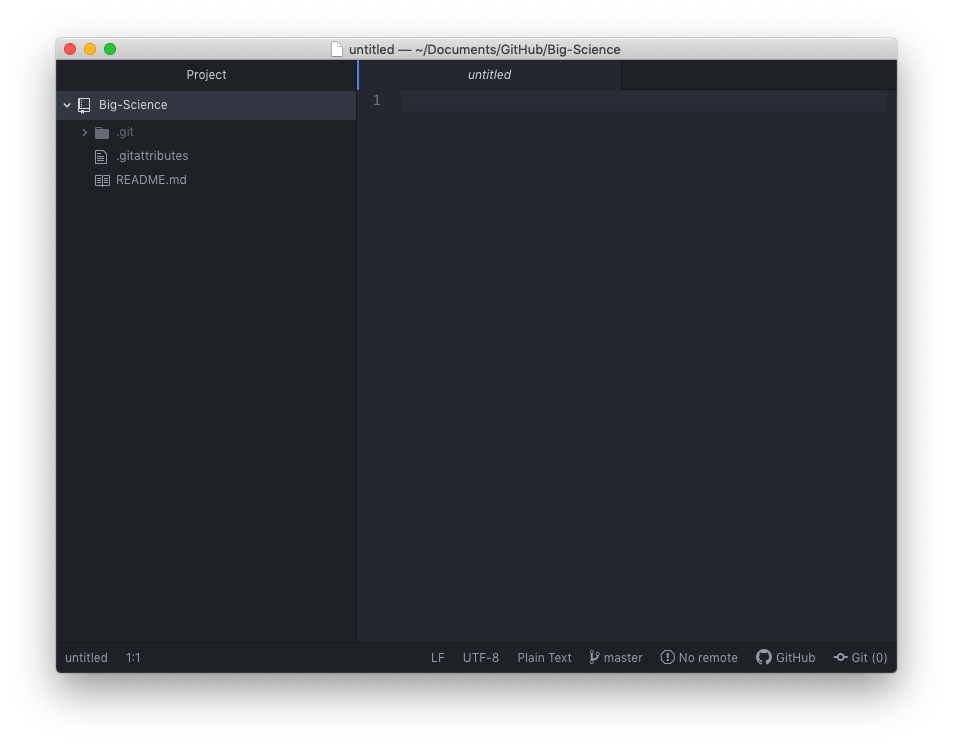
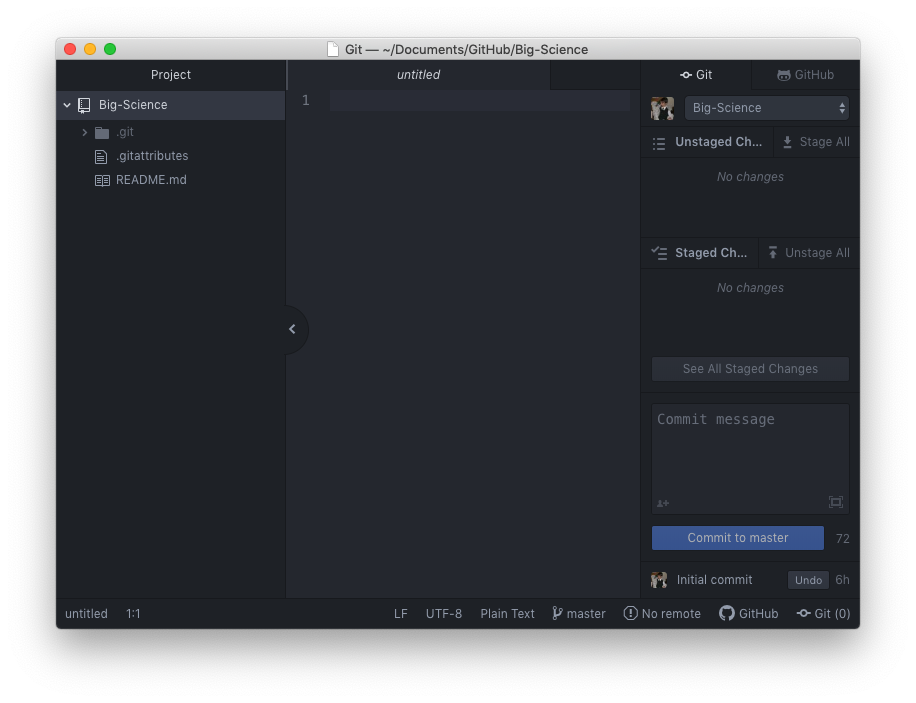
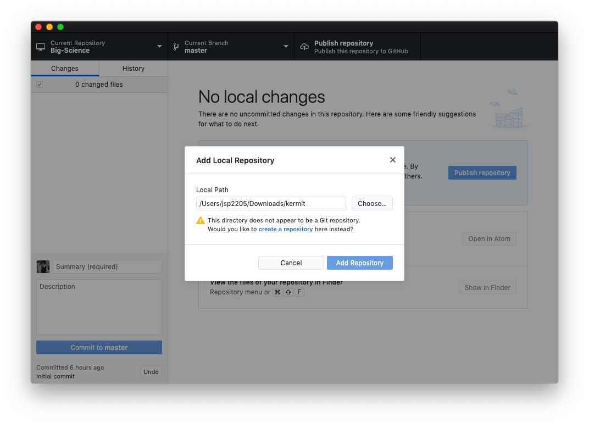

Now that we've configured GitHub Desktop to work with our account, let's create our first [repository]({{ page.root }}#repository)—a place where Git can store different versions of our files by keeping track of the differences between text documents.  Click on *New Repository* under the *File* menu or type <kbd>Ctrl</kbd>-<kbd>N</kbd>.  You will now be presented with a prompt with a number of fields (such as the repository name).  In the example below, we will *initialize* a repository named "Big Science".  [Initialization]({{ page.root }}#initialization) is the term that Git uses to indicate that it will start tracking changes amongst files in a folder.  

Note that GitHub Desktop automatically replaces spaces with hyphens in repository names.  We can also tell GitHub Desktop to create the repository with a Read Me document, a canned software license, and a file that tells Git to **not** track certain files (*Git Ignore*).  We will be discussing software licensing and blacklisting files later on in more detail.

Clicking on *Create Repository* should bring you to the following screen:

Click the button that says *Show in Finder* or *Show in File Explorer*.  Notice that your new repository lives within a folder named *GitHub* that is nested within your home directory.  

Now, click the button that says *Open in Atom*.  This will open up the project directory in the Atom text editor.

On the lefthand side of the Atom window, there is a *Project* pane, which contains a file browser for all documents within your Git repository.  You may notice that there is a directory within the *Project* pane named `.git` that is not visible in either the Finder or the Windows File Explorer.  Git uses this special hidden folder as a database that stores all the information about changes that have been made within the project.
If we ever delete the `.git` folder, we will lose the project's history.

If we click the *Git* button in the lower righthand corner, we can see that Git is already keeping track of which files have changed and which have not.  Changes to a file that git is not sure if you want to keep are referred to as [unstaged]({{ page.root }}#staging).  Currently, there are no changes to the project, so Git reports no news.  We will make some changes later on to show how saving changes to the hidden database stored in the `.git` folder works.

## Tracking Folders that Already Exist with Git

Now suppose, however, that we already have a folder filled with previously untracked documents that we want to start tracking now.  We can start tracking the contents of this folder by navigating to *File* within GitHub Desktop, followed by *Add Local Repository* or by typing <kbd>Ctrl</kbd>-<kbd>O</kbd>.  Click *Choose* and navigate to the folder whose contents you want to track.  Click the blue *create a repository* hyperlink.  You should then receive the same *Create a New Repository* dialogue from before.  Click *Create Repository* again.

> ## Don't Initialize Git Repositories within Git Repositories
>
> The database within the hidden `.git` folder tracks any and all files both within a folder and within the subfolders within that folder.
> Git assumes that there is only one `.git` folder at the top level of any set of nested folders on your drive.
> If there are two or more `.git` folders (e.g., one `.git` folder in the main project folder and then another `.git` within a subfolder), Git will become confused.  You can fix this by deleting any `.git` directories in nested folders using Atom.  Within Atom, right-click on the extra `.git` directories and click *Delete*.
{: .callout}

