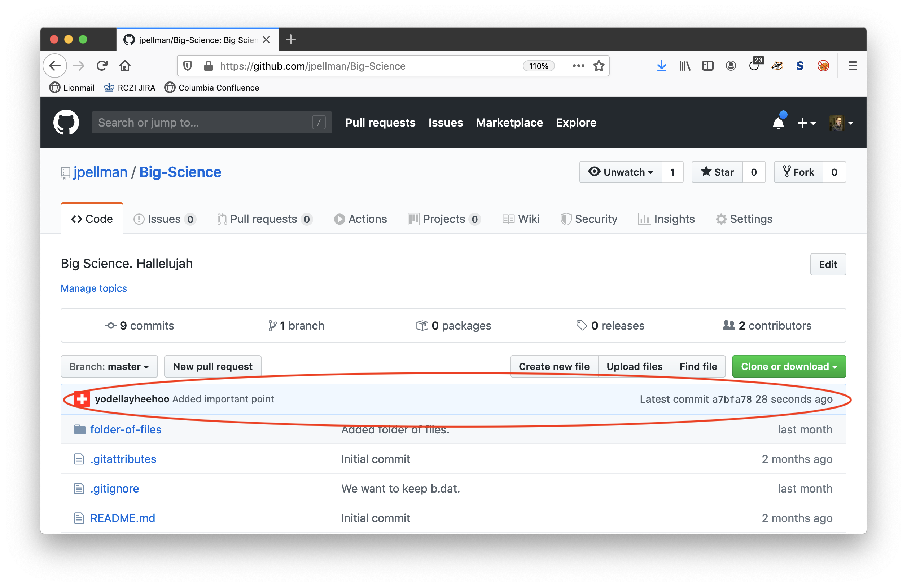
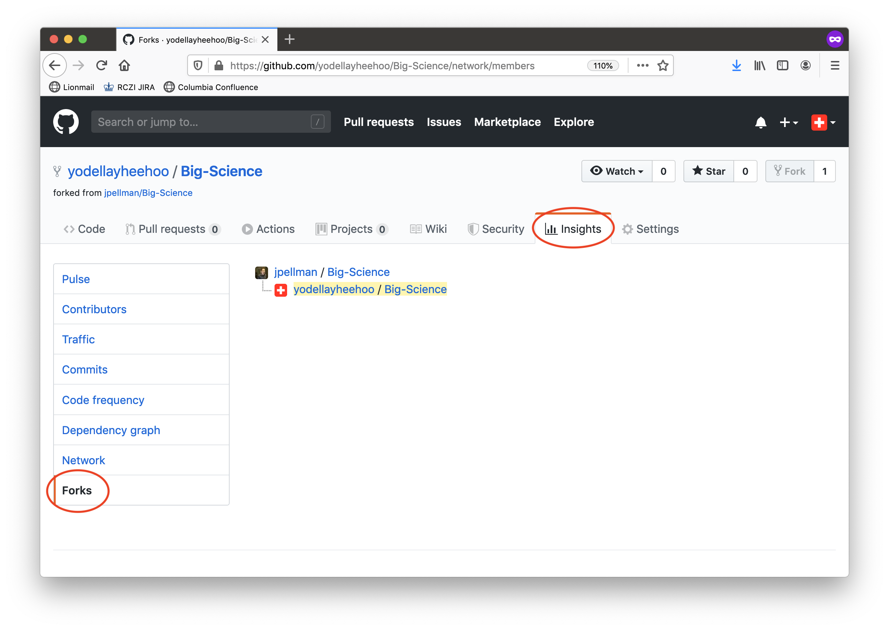
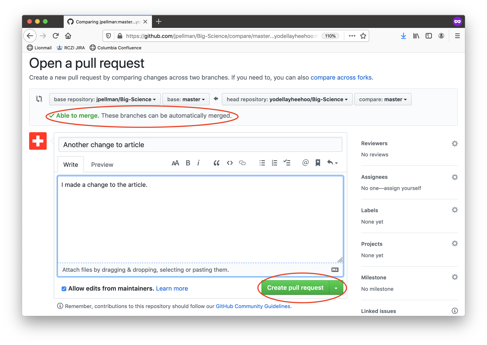
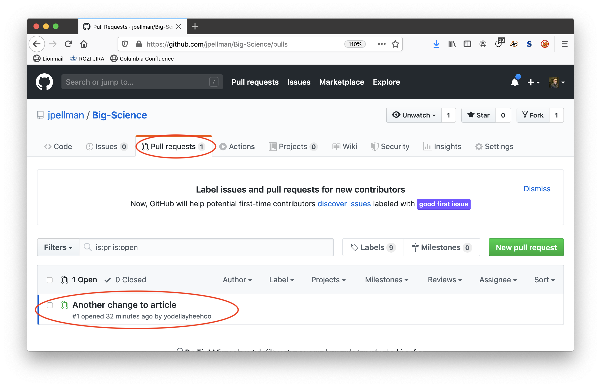
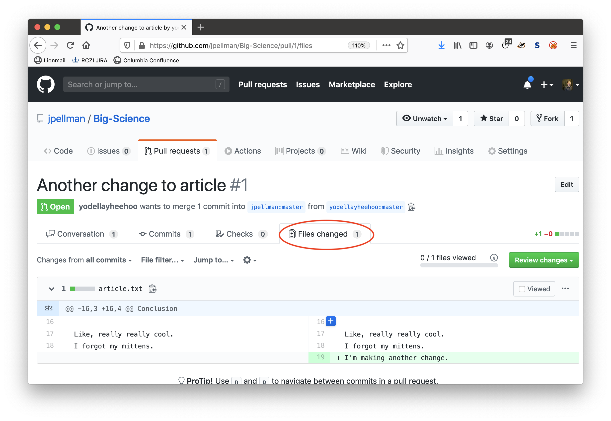
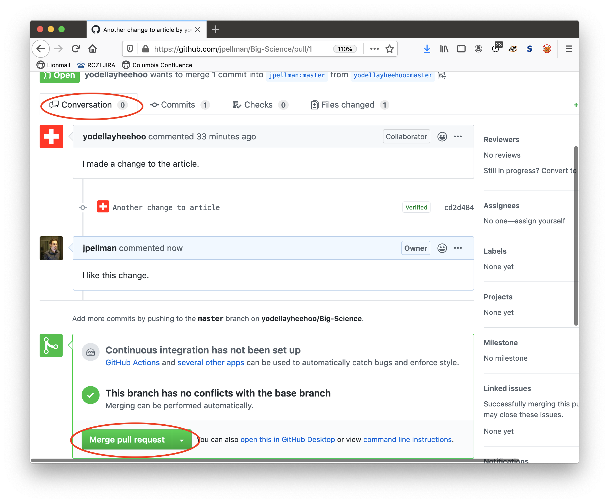

Imagine that you want to collaborate with a colleague on a paper or software project.  With GitHub, there are two workflows you can use to collaborate with other researchers with GitHub accounts- a workflow where colleagues have direct read/write access to your repository, and one where you can review proposed changes before adding them to your code base.  Let's go over both workflows using a few hypothetical examples.

## Direct Access Workflow

In a direct access workflow, the owner of a repository on GitHub (i.e., the person whose GitHub account the repository lives under) grants the ability to push changes (commits) directly to a collaborator.  This workflow is ideal for close collaborators that you have high trust in, and whom you expect to update your paper or codebase regularly without consulting you.

For instance, let's say that I want another researcher named Laurie to collaborate on the *Big-Science* repository containing my article.  I would first navigate to my repository on GitHub by selecting my repository in the GitHub Desktop interface, and then clicking the *Repository* dropdown at the top of the window or screen and selecting *View on GitHub* (this can also be accomplished by typing <kbd>Shift</kbd> - <kbd>Command</kbd> - <kbd>G</kbd> on Mac OS X).  At the time of writing (April 2020), I would then click the *Settings* button on the right on the right of the page, then select *Manage access* in the lefthand pane, scroll down, click the green *Invite a collaborator* button and enter Laurie's username, full name, or email address.  If you do not see any of these buttons or dropdowns, consult the latest official GitHub documentation [here](https://help.github.com/en/github/setting-up-and-managing-your-github-user-account/inviting-collaborators-to-a-personal-repository).

Laurie will now receive an email inviting her to collaborate on this repository. To accept access to the my repository, Laurie will need to follow a link within that email and accept access to *Big-Science*.

Next, Laurie will need to download a copy of *Big-Science* to her machine. This is called "cloning a repository". To clone *Big-Science* with the GitHub Desktop application, Laurie can navigate to *File* -> *Clone Repository...* or type <kbd>Shift</kbd> - <kbd>Command</kbd> - <kbd>O</kbd> on Mac OS X.  She will then be presented with a dialogue containing all the repositories she has access to, where she can select *Big-Science* and press the blue *Clone* button to continue.

Laurie can now make a change in her clone of *Big-Science*, using the same methods from sections 2-6 of this workshop.  When she's finished and has pushed her changes to the remote named `origin`, we will see them reflected in GitHub:

To download Laurie's changes from GitHub, I can then fetch the changes by clicking *Fetch origin* (as per [section 6]({{ page.root }}/06-remotes)), and then download them by clicking *Pull origin*.

Now the three copies of the repository (my local copy, Laurie's local copy, and the remote copy on GitHub) are synchronized.

## Code Review Workflow

In a code review workflow, a collaborator (such as Laurie) would first make a remote copy of my repository (a process known as [forking](https://en.wikipedia.org/wiki/Fork_(software_development))), clone her remote copy, make some changes to her copy, and then push her changes to her own copy on GitHub.  In this way, there would be four copies of the GitHub repository, two remote copies for both me and Laurie, and two local copies for both of us.

To make a remote copy, Laurie would navigate to the my repository on the GitHub website.  She would then click on the *Fork* button in the upper righthand corner.

After Laurie's copy has been made, we can see that GitHub keeps track of where her copy was made from.  We also notice that the number embedded in the *Fork* button has incremented by 1 to reflect the number of copies in existence.

If we click *Insights*, followed by *Forks*, we can even see a full tree graph of all the copies of a repository that have been made in GitHub.  In this case, there is only one copy that has been made from the original, but for some repositories on GitHub (such as the `numpy` repository), this graph can become quite large.

As mentioned earlier, Laurie would now go through the conventional clone, stage, commit, and push cycle for a Git repository, with her changes pushed to her personal copy on GitHub instead of the main copy.  After her changes have been uploaded to her personal copy on GitHub, she can make sure that they're added to the original copy by opening a *Pull Request*.  A pull request is a method for merging the changes from one version of a Git repository into another, even if they have separate histories.  There are methods for dealing with conflicting changes, which we will discuss in further detail in the next section.

To make a pull request, Laurie would click the "Pull Requests" tab in her remote copy of the repository on GitHub after she's pushed her changes to it.  She would then click the green *New pull request* button.

Laurie will then be presented with a screen in which the differences between her remote copy of the repository and my remote copy of the repository are shown.  If the changes look right, she can then proceed by clicking on the green *Create pull request* button.

Next, Laurie can provide a descriptive message about what changes she made so that when I review her changes (the next major step) I know in general terms what they are.  When she's done, she can click the green *Create pull request* button again.  Note the dialogue at the top of the screen stating that the change is "Able to be merged".  This indicates that there aren't any conflicting changes between my remote copy and Laurie's remote copy, so Git can reconcile the two seamlessly.

Now that Laurie has made her changes, I can review them on my end, and we can discuss them if necessary in a threaded conversation in the pull request.  Pull requests are analogous to the peer review process but for code or other text documents (and are much less formal).

I do this by clicking on the *Pull requests* tab in my remote copy of the repository on the GitHub website.  I then can click on Laurie's pull request to review it.

I can view the specific changes by clicking on the *Files changed* tab.

I can then discuss the changes with Laurie (if necessary) in the *Conversations* tab.  When I'm done, I click the green *Merge pull request* button at the bottom of the conversation thread followed by the ensuing *Confirm merge* button.  

Laurie's changes have now been integrated into the history of the primary repository on GitHub.  As part of the merging process, another commit will be made to reflect the act of merging.
